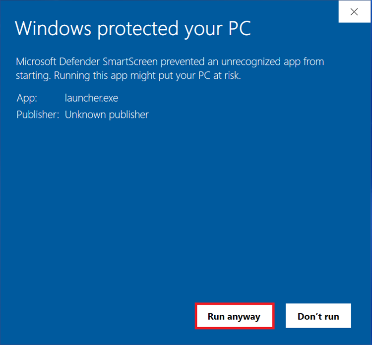
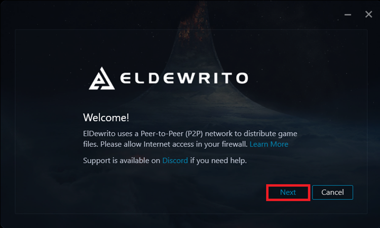
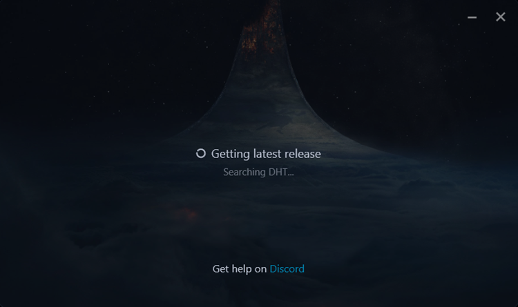
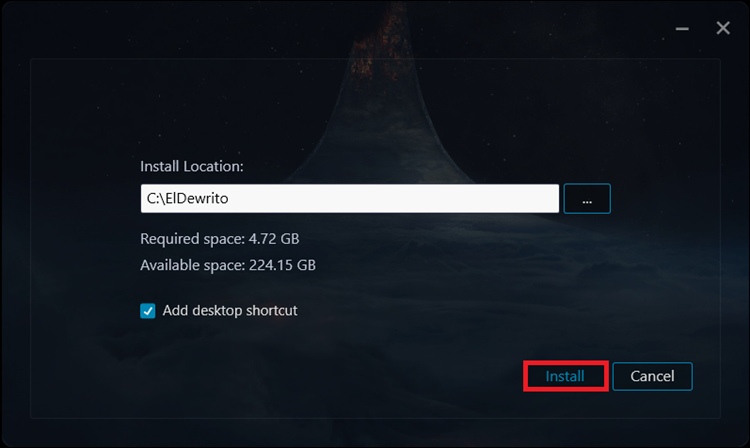
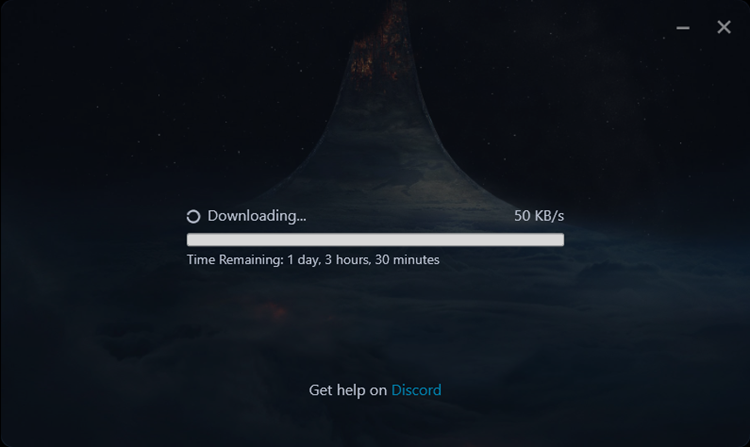
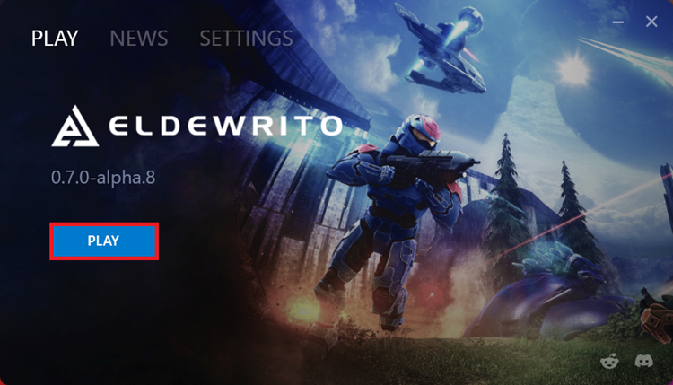
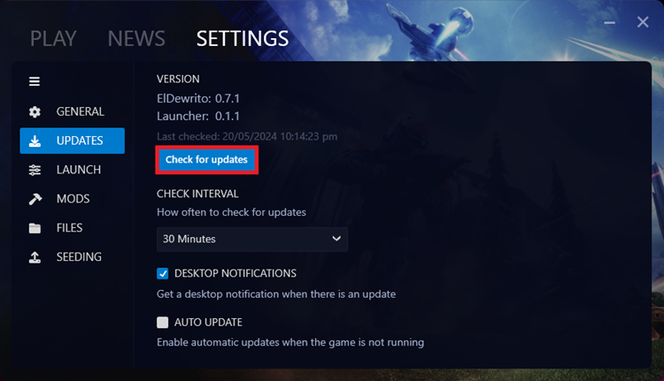
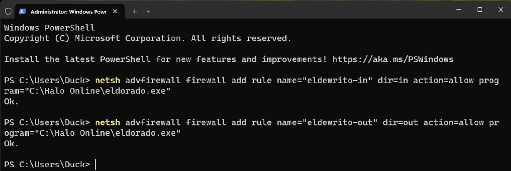

# ElDewrito-Guide

Last update: 10 January 2025

Support on [Discord](http://eldewrito.org/discord) | [Reddit](http://eldewrito.org/reddit) | [Website](http://eldewrito.org/)

## What is ElDewrito?
ElDewrito is a free modification for Halo Online, which was a Halo on PC video game developed 
by Saber Interactive and canceled by Microsoft in 2015. ElDewrito completely reimagines Halo 
Online to bring you a fan-made Halo experience. 

<a href="https://www.reddit.com/r/HaloOnline/comments/1ewqbzj/average_castle_wars_match/"></a>
<a href="https://www.reddit.com/r/HaloOnline/comments/1hbmjup/teammates_done_dirty_credit_microwaveoven/"></a>
<a href="https://www.reddit.com/r/HaloOnline/comments/1ccifwi/me_logging_in_expecting_anything_normal/"></a>

The original ElDewrito team disbanded in 2018 with the release of v0.6.1.0 after the team announced an indefinite pause to development.

ElDewrito 0.7 was released by a new team in 2024 with new content and significant improvements. A full changelog is available [here](http://eldewrito.org/changelog).

ElDewrito has an active playerbase that primarily organises games through [HaloBase on Discord](https://discord.com/invite/PxPNNteChR).

## Installing ElDewrito

### Windows
1.	Download the [ElDewrito Launcher](http://eldewrito.org/download) [(Virustotal)](https://www.virustotal.com/gui/file/7ce2de9987684a505de05a4ea5b21b80b0d1514ff1b66af72353a1de773eb61a).
2.	Run the Launcher (do not run as administrator).
3.	Ignore Windows Smartscreen if prompted.



4.	Click ‘Next’.



5.	Wait for the Launcher to find the latest version.



6.	Select your install location then click ‘Install’. We recommend your desktop folder.



7.	Wait for the launcher to download and install ElDewrito.



8.	Click ‘Play’ on the welcome screen after installation is complete.



9.	Enjoy! Remember to seed to support the game’s distribution network. [Seeding Guide](http://eldewrito.org/seed).

    Join [HaloBase](https://discord.gg/PxPNNteChR) and get yourself the LFG role in #welcome to find other players.

    Modpacks are available at our [Modpacks Discord server](http://eldewrito.org/mods).

### Steam Deck and Linux Distros
You can also play ElDewrito on the Steam Deck and Linux distros through Steam Play.

1.	Download the [ElDewrito Launcher](http://eldewrito.org/download) [(Virustotal)](https://www.virustotal.com/gui/file/7ce2de9987684a505de05a4ea5b21b80b0d1514ff1b66af72353a1de773eb61a).

2.	Open Steam settings.

3.	Navigate to the Compatibility header.

4.	Check ‘Enable Steam Play for all other titles’.

5.	Select Proton 8.0-5 from the drop-down menu.

6.	Click ‘Ok’ then restart Steam.

7.	Add ElDewrito to your Steam library.

8.	Add the following as a launch option/argument for the ElDewrito Launcher’s properties in Steam:

    ```DOTNET_BUNDLE_EXTRACT_BASE_DIR=.cache %command%```

9.	Run the ElDewrito Launcher through Steam then install .NET 6.0 Desktop Runtime (v6.0.36) to the ElDewrito Launcher’s directory when prompted.

10.	Run ElDewrito through Steam and enjoy!

Credit to @parmejuan. on Discord for the Steam/Proton guide.

You can alternatively play ElDewrito using Lutris ([Instructions](https://discord.com/channels/84694847729963008/1232232873260482602/1235007335265599589) are available on the [ElDewrito Discord server](http://eldewrito.org/discord)). 

Credit to @thelongwayhome on Discord for the Lutris guide.

### MacOS
1.	[Install GPTK (Game Porting Tool Kit)](https://www.applegamingwiki.com/wiki/Game_Porting_Toolkit).

2.	Download the [ElDewrito Launcher](http://eldewrito.org/download) [(Virustotal)](https://www.virustotal.com/gui/file/7ce2de9987684a505de05a4ea5b21b80b0d1514ff1b66af72353a1de773eb61a).

3.	[Download .NET 6.0.2 Installer](https://dotnet.microsoft.com/en-us/download/dotnet/thank-you/sdk-6.0.424-windows-x64-installer).

4.	Extract all files to the GTPK directory (default name is 'my-game-prefix').

    ```\Users~\my-game-prefix\Program_Files```

5.	Run the .NET installer through the GPTK terminal.

    ```gameportingtoolkit~/my-game-prefix 'C:\Program_Files\windowsdesktop-runtime-6.0.32-win-x64.exe'```

6.	Run the ElDewrito Launcher — install to 'Program_Files' directory.

    ```gameportingtoolkit ~/my-game-prefix 'C:\Program_files\launcher.exe```

7.	Go into the ElDewrito folder, open "data/dewrito_prefs.cfg" and set Game.CEFGpuEnable to 0. Crete dewrito_prefs.cfg if it does not exist.

8.	Run Halo Online with the 'no-esync' prefix.

    ```gameportingtoolkit-no-esync ~/my-game-prefix 'C:\Program Files\ElDewrito\eldorado.exe'```

NOTE: If you have a controller or gamepad, you will need to plug it in before launching ElDewrito.

Credit to @sahuntermech on Discord for the MacOS guide.

## Issues and fixes

### Update issues
1.	Place the latest ElDewrito launcher (16 May 2024) in your ElDewrito folder.

2.	Run the launcher.

3.	Go to Settings > Updates to force check for an update if it doesn't check itself.



If your launcher cannot find the [latest ElDewrito version](#appendix), torrenting is blocked on your 
network. You can bypass torrent restrictions by using a VPN service. Direct Message 
@duckfudge on Discord for additional support.

### Stuck on main menu and low framerates/poor performance
Unzip the contents of this [DXVK implementation](https://github.com/duckfudge/eldewrito-dxvk/releases/latest) into your ElDewrito folder with 
eldorado.exe.

Your game will stutter on the first run of any map and first load times will increase. You 
will have butter-smooth performance after restarting the game and loading the same 
map.

Vulkan 1.3 support is required. ElDewrito will crash if your PC does not support DXVK — 
delete the files if this is the case.

### Menus are not working
Go to ‘data\dewrito_prefs.cfg’ in your ElDewrito folder and change Game.CEFGpuEnable 
to 0 or add this line if it does not exist:

```Game.CEFGpuEnable 0```

#### Simple fix: Place [this file](https://drive.google.com/file/d/1z86tuc_W98ai9L9fbcPwoysulENbzUwK) in your ElDewrito folder with eldorado.exe.

### Launcher fails to start and Torrentlib error
Your PC is missing a dependency.
 - General failure: Install [this](https://dotnet.microsoft.com/en-us/download/dotnet/thank-you/runtime-desktop-6.0.29-windows-x64-installer).
 - Torrentlib error: Install [this](https://aka.ms/vs/17/release/vc_redist.x64.exe).

### Network issues
Your ISP may be blocking torrents. In this case, we suggest using a VPN like [Cloudflare WARP](https://1111-releases.cloudflareclient.com/win/latest) 
or tethering your mobile data connection to your PC.

ElDewrito may also be blocked by your PC’s firewall. Run the following in Command Prompt or Powershell as Administrator:

1.	```netsh advfirewall firewall add rule name="eldewrito-in" dir=in action=allow program="C:\ElDewrito\eldorado.exe"```

2.	```netsh advfirewall firewall add rule name="eldewrito-out" dir=out action=allow program="C:\ElDewrito\eldorado.exe"```

Replace ‘C:\ElDewrito\’ in the command with the path to your ElDewrito folder.

Use the same command with the path to the launcher if it cannot access the Internet.



## Community

### Content
You can find custom game modes, mod packs, and other community content at:
 - [ElDewrito Modpacks](http://eldewrito.ch/mods)
 - [Killnothing’s Repository](http://killnothing.gay/)
 - [ZGAF Fileshare](https://fileshare.zgaf.io/)

### Spaces
The most-active Discord communities for ElDewrito are:
 - [HaloBase](https://discord.gg/PxPNNteChR)
 - [ElDewrito Main](https://discord.gg/0TKY0SDEUHAWL4sG)
 - [ElDewrito Modpacks](http://eldewrito.ch/mods)
 - [Halo Bois (Killnothing’s Server)](https://discord.gg/5s3m4Heey8)
 - [Capybara Containment Cell](https://discord.gg/Pnb9aSq9XN)

HaloBase/HB has a Looking-for-Group (LFG) role in its welcome channel that players ping for daily game sessions that often run for several hours.

## Support and thanks
You can find support for ElDewrito on our [Discord Server](http://eldewrito.ch/discord), [Subreddit](http://eldewrito.org/reddit), and [Website](http://eldewrito.org/).

ElDewrito 0.7 was developed as a community effort over six years with contributions from 
40+ members from all over the world. We give our most sincere gratitude to those 
members for their contributions, guidance, and support. ElDewrito 0.7 was possible 
through tireless effort, lulls & sprints, and determination to create an experience fit for the 
Halo franchise’s fans.

You can support ElDewrito by hosting servers and [seeding](http://eldewrito.org/seed).

## Appendix
Current release version: 0.7.1

Release date: 16 May 2024

[Changelog](http://eldewrito.ch/changelog)

### Source Code and Downloads
 - [ElDewrito Launcher](https://github.com/eldewrito2/ElDewritoLauncher)
 - [Epsilon — ElDewrito Cache Editing](https://github.com/TheGuardians/EpsilonPublic)
 - [Master Server](https://github.com/thebeerkeg/rust-eldewrito-master-server)
 - [TagTool](https://github.com/TheGuardians/TagTool/)
